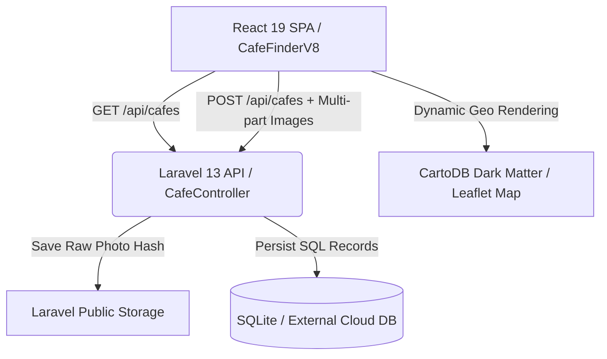

# 🇵🇭 Cebu IT Park Cafe Finder (VOL.08 / FINAL EDITION)

[](https://laravel.com)
[](https://react.dev)
[](https://leafletjs.com)
[](https://sqlite.org)
[](https://vercel.com)

An ultra-premium, interactive dark-themed SPA crafted specifically for digital nomads, English learners (ESL students), and remote workers in **Cebu IT Park, Philippines**. 
Easily find study-friendly cafes based on actual internet speed specs, outlet availability, 24-hour schedules, and precise geographic pinning.

---

## 🎨 Premium Dark Glassmorphic Design

The application is styled with a highly curated **dark glassmorphism design system** (`data-theme="dark"` default) and subtle micro-animations that make the interface feel alive and premium.



---

## 💡 Key Features Tailored for Cebu IT Park Learners

- **📶 Real-time WiFi Specs**: Filter by strict speed metrics (e.g., `EXCELLENT` for >100Mbps, `GOOD`, `AVERAGE`).
- **🔌 Power Outlet Status**: Spot cafes with guaranteed plugs (`YES`), partial charging hubs (`LIMITED`), or no sockets (`NO`).
- **🕐 24/7 filter**: Deep integration for night owls and international remote workers looking for 24-hour study spots in Cebu.
- **🗺 Dynamic Leaflet Pinning**: Open-source, high-performance map using CartoDB Dark Matter tiles. Absolutely free, requiring zero expensive Google Maps API key setups for clone users!
- **📸 Secure Multi-Image Upload**: Supports smooth drag-and-drop or file pick of up to 3 high-resolution photos representing actual workspace vibes.

---

## 🔒 Security Architectures (GitHub Release Optimized)

To ensure this application is completely safe for public release and open-source contributions, the following layers have been meticulously engineered:

1. **Anti-Leak API Key Architecture**: By using **Leaflet (react-leaflet)** and OpenStreetMap CartoDB tiles, the application has **zero dependencies on Google Maps or other paid cloud APIs**. No hardcoded keys can ever leak!
2. **Robust Multi-Image Validation**: The backend executes strict MIME type checks (`jpeg, png, jpg, webp`), maximum size constraints (up to `3MB` per image), and extension spoofing detection to block malicious scripts (`.php`, `.sh`, etc.) from being uploaded.
3. **Session-based CSRF Protection**: Fully secured using Laravel's session-based CSRF state. `authFetch` automatically appends and syncs `X-CSRF-TOKEN` headers.
4. **Coordinate Bounds Control**: Prevents geo-coordinate spamming by strictly limiting coordinate entries to Cebu City's boundary boundaries (Latitude: `9.8` to `10.8`, Longitude: `123.5` to `124.5`).

---

## 🚀 Local Installation (5 Minutes)

### Prerequisites
- PHP 8.2+
- Node.js 18+
- Composer

### Steps
1. **Clone the repository**:
   ```bash
   git clone https://github.com/your-username/cafe-finder.git
   cd cafe-finder
   ```

2. **Backend Setup**:
   ```bash
   composer install
   cp .env.example .env
   php artisan key:generate
   ```

3. **Initialize Database & Storage Symlink**:
   ```bash
   touch database/database.sqlite
   php artisan migrate:fresh --seed
   php artisan storage:link
   ```

4. **Frontend Setup**:
   ```bash
   npm install
   npm run dev
   ```

5. **Serve the Application**:
   ```bash
   php artisan serve
   ```
   Open your browser at `http://127.0.0.1:8000` to start exploring!

---

## ⚡ Vercel Deployment in 5 Minutes

This repository comes pre-packaged with a perfect, zero-configuration Vercel serverless integration framework:

1. **`vercel.json`**: Standardized routing configuration mapping frontend React build files to `/public` and redirecting API pathways dynamically to `api/index.php`.
2. **`api/index.php`**: Highly efficient serverless bridge gateway that requires Laravel's central public bootstrap scripts under Vercel's stateless directory constraints.

To deploy immediately to Vercel:
```bash
# Install Vercel CLI
npm install -g vercel

# Login and deploy
vercel
```

*Note: Because Vercel's local filesystem is read-only, configure session storage to `cookie` or `database` and connect to an external SQL cloud database (e.g. Neon, Supabase) for live production setups.*

---

## 📄 License
This project is open-source software licensed under the [MIT License](LICENSE).
Created with ☕ and ❤️ for digital nomads in Cebu City.
